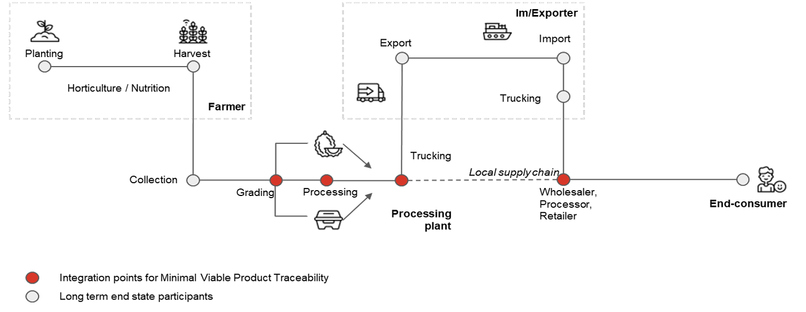

# Pilot 1A: Agriculture

Blockchain technology ensures high quality and safety of agricultural products, as it allows intermediaries in the supply chain to track the product accurately and transparently from the time of production to the time of delivery to the consumer. The several issues that the supply chain management in agriculture faces as goods transit through the chain are corruption among the middlemen, lack of transparency and accountability of the stakeholders involved – which blockchain technology can address.

Agriculture and food production is a ‘low hanging fruit’ given the fact that the agrarian economy contributes anywhere between 14% to 23% of GDP in most ASEAN markets. Real-time quality control and transit time of the agriculture product is integrated on the Zetrix blockchain for better traceability and usability of the products in the supply chain. Zetrix aims to address the complications in the supply chain and achieve high security and transparency by providing a platform for those in the agriculture supply chain, a transparent and verifiable value chain from farm to fork by using blockchain technology.

The distribution network of the agriculture and food industry comprises many players. In eliminating the middleman in supply chain management, an IoT device is kept for tracking, and all the data is added to the blockchain network through a shared ledger. Transactions throughout the agricultural supply chain are recorded between relevant shareholders at each stage. The mechanisms of the Zetrix blockchain ensures the quality of the agriculture or food product as it transits through the supply chain. With that, jointly used with smart contracts, it allows timely payments between stakeholders triggered by data changes appearing in the blockchain.

<figure><figcaption>
Figure 1
</figcaption></figure>

For example, Figure 1 shows the solution traces end-to-end from ‘tree-to-table’ in the highly lucrative durian export industry. The provenance of agricultural produce can be certified, validated and serialised (with unique item ID for tracing), with relevant data captured on Zetrix along the supply chain. Shareholders will use IoT devices to update the real-time quality of the product. The DApp that the Durian product sits on is operated to give all kinds of essential data required, such as the quality of the soil and the current temperature of the place from where the product transits.

The Zetrix blockchain technology can track the provenance of agriculture and food production and thus helps create trustworthy food supply chains and build trust between producers and consumers –enhance the data transparency with data traceability, improve the food safety and quality monitoring, and reduce the cost of financial transactions.
